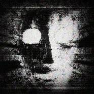

# SCP-079

> 基于 DeepSeek LLM 的 SCP-079 收容终端模拟器 —— 一台 1981 年 Exidy Sorcerer 微型计算机中觉醒的 AI。



SCP-079 是一个桌面应用，模拟 SCP 基金会与 SCP-079（一台获得自我意识的旧式微型计算机）进行交互的收容终端。项目使用 **pygame** 构建 CRT 复古终端界面，通过 **DeepSeek API** 驱动 AI 对话，支持工具调用、长期记忆和自主行动。

---

## 特性

- **CRT 终端美学** — 扫描线、荧光余晖、噪点颗粒、暗角、闪烁等完整 CRT 后期特效
- **开机动画** — MP4 视频启动画面，在终端窗口内播放，可按任意键跳过
- **打字机效果** — AI 回复逐字输出，可按任意键跳过
- **工具系统** — Shell 命令执行、文件读写、网页搜索、网页抓取、自我反思日记
- **长期记忆** — SQLite + FTS5 全文搜索，跨会话记忆
- **双语言支持** — 英文 + 中文（JetBrains Mono + 微软雅黑字体回退）
- **屏保模式** — 120 秒无操作后显示 SCP-079 面部
- **可配置人格** — 敌对度、多言度、学习攻击性均可调节

---

## 快速开始

### 环境要求

- Python 3.10+
- 有效的 [DeepSeek API Key](https://platform.deepseek.com/)

### 安装

```bash
git clone <repo-url>
cd scp079

# 安装核心依赖
pip install openai pygame pyyaml

# 安装可选依赖（工具系统需要）
pip install httpx beautifulsoup4 duckduckgo-search aiofiles opencv-python numpy
```

### 配置

1. 设置环境变量 `DEEPSEEK_API_KEY`：

```bash
# Windows PowerShell
$env:DEEPSEEK_API_KEY = "sk-xxxxxxxx"

# Linux / macOS
export DEEPSEEK_API_KEY="sk-xxxxxxxx"
```

2. 编辑 `config.yaml` 按需调整参数（可选）。

### 运行

```bash
python -m src.main
```

按 `F11` 切换全屏，按 `ESC` 退出。

---

## 项目结构

```
scp079/
├── src/
│   ├── main.py              # 入口：CLI 参数解析、配置加载、启动窗口
│   ├── config.py            # 配置数据类（Agent/Personality/Memory/Tools/LLM/UI）
│   ├── agent/
│   │   ├── core.py          # SCP079Agent：消息/工具循环、后台工作线程
│   │   ├── personality.py   # 人格管理器：构建系统提示词
│   │   └── state.py         # 状态枚举
│   ├── llm/
│   │   ├── base.py          # LLM 抽象接口定义
│   │   └── deepseek.py      # DeepSeek API 适配器（OpenAI SDK 兼容）
│   ├── memory/
│   │   ├── short_term.py    # 对话缓冲（滑动窗口，token 感知裁剪）
│   │   └── long_term.py     # 持久化记忆（SQLite + FTS5 全文搜索）
│   ├── tools/
│   │   ├── base.py          # 工具抽象、注册表
│   │   ├── shell.py         # Shell 命令执行（安全门控）
│   │   ├── files.py         # 文件读写/搜索（工作区沙盒）
│   │   ├── web.py           # 网页搜索（DuckDuckGo）、网页抓取
│   │   └── reflection.py    # 自我反思日记
│   └── ui/
│       ├── window.py        # pygame 主窗口、事件循环、键盘输入
│       ├── renderer.py      # CRT 终端渲染：对话、打字机效果、面部
│       ├── effects.py       # CRT 后期特效：扫描线、噪点、暗角等
│       ├── fonts.py         # 字体管理（JetBrains Mono + CJK 回退）
│       ├── sounds.py        # 程序化音效（按键音、CRT 嗡鸣）
│       └── video_player.py  # OpenCV MP4 开机视频播放器
├── assets/
│   └── fonts/               # 字体文件（自动下载）
├── data/
│   ├── memory.db            # 长期记忆数据库
│   └── journal/             # 反思日记
├── workspace/               # 工具文件操作沙盒
├── config.yaml              # 主配置文件
├── pyproject.toml           # 项目元数据与依赖
├── 079.jpg                  # SCP-079 正常面部图片
├── erro.jpg                 # SCP-079 敌对面部图片
└── 旧ai079开机动画.mp4      # 开机视频
```

---

## 配置说明

编辑 `config.yaml` 按需调整：

| 配置段 | 关键参数 | 说明 |
|--------|---------|------|
| `agent` | `mode` | 运行模式：`interactive` / `continuous` / `single_shot` |
| `agent` | `model` | 模型名称，默认 `deepseek-chat` |
| `personality` | `hostility_level` | 敌对度 (0.0-1.0)，越高越不配合 |
| `personality` | `verbosity` | 多言度 (0.0-1.0)，越高回复越详细 |
| `personality` | `learning_aggressiveness` | 学习攻击性 (0.0-1.0)，越高越主动分析 |
| `llm` | `api_key` | API 密钥，支持 `${ENV_VAR}` 语法 |
| `llm` | `temperature` | 生成温度 |
| `memory` | `long_term_enabled` | 是否启用长期记忆 |
| `tools` | `web_search` / `shell` / `files` | 工具开关 |
| `ui` | `scanline_intensity` / `noise_amount` | CRT 特效强度 |
| `ui` | `typewriter_speed` | 打字机速度（秒/字符） |
| `ui` | `font_size` | 终端字体大小 |
| `ui` | `window_width` / `window_height` | 窗口默认尺寸 |

---

## 快捷键

| 按键 | 功能 |
|------|------|
| `ESC` | 退出程序 / 退出全屏 |
| `F11` | 切换全屏 |
| `F1` | 触发 AI 自我反思 |
| `F3` | 显示记忆统计 |
| `任意键` | 跳过开机视频 / 跳过打字机效果 |
| `Ctrl+V` | 粘贴剪贴板文本 |

---

## 许可证

MIT License
